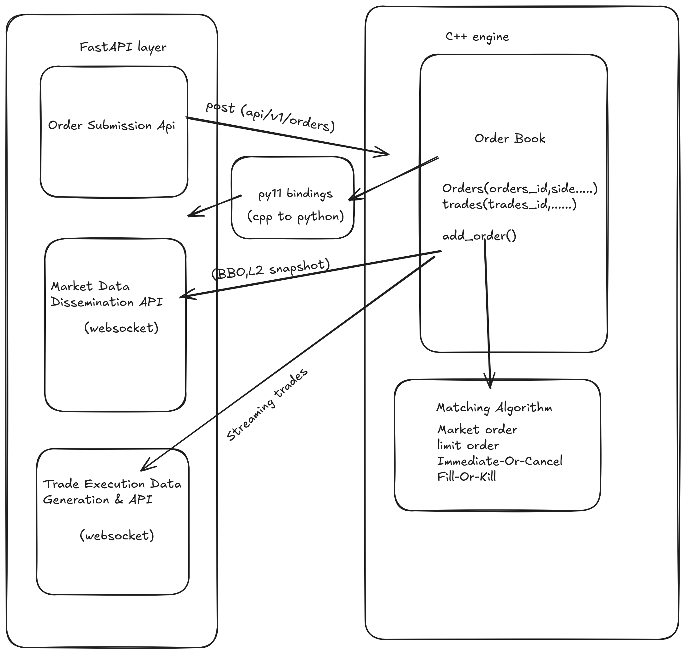

# Crypto Matching Engine

A high-performance, REG NMS–inspired cryptocurrency matching engine built in C++ with Python bindings and a FastAPI interface.  
It supports real-time order matching, best bid and offer (BBO) dissemination, and live trade execution streaming. The engine is optimized for low latency and high throughput.


## Architecture


## Directory Structure

├── app
│   ├── books                # Order book logic
│   ├── routes               # WebSocket and REST endpoints
│   ├── utils                # Utility modules
│   └── main.py              # FastAPI entry point
├── cpp_engine
│   ├── bindings.cpp         # Python bindings for C++ engine
│   ├── OrderBook.cpp        # Core matching engine implementation
│   ├── market_data.cpp      # Market data generation
│   ├── test.cpp             # C++ tests
│   └── include              # Header files
├── tests
│   ├── unit_testing         # Unit tests for matching logic
│   ├── integration_testing  # Integration and API tests
│   └── lua                  # Lua scripts for load testing
├── build                    # Build artifacts
├── matching_engine.cpython-311-x86_64-linux-gnu.so  # Compiled shared library
├── setup.py
├── pyproject.toml
└── README.md


## Overview

The matching engine is responsible for maintaining the order book, calculating the BBO, executing trades based on strict price-time priority, and streaming both market data and trade execution events to connected clients.


## Matching Engine Logic

### BBO Calculation and Dissemination
- Maintains an accurate, real-time Best Bid and Offer (BBO) for each trading pair.
- Updates the BBO instantaneously whenever an order is added, modified, canceled, or matched.

### Internal Order Protection and Price-Time Priority
- Implements strict price-time (FIFO) priority within each price level.
- Prioritizes better-priced orders: higher bids and lower offers take precedence.
- Prevents internal trade-throughs: all marketable orders are filled at the best available prices before moving to deeper price levels.

### Order Type Handling
- **Market Order** - Executes immediately at the best available prices.
- **Limit Order** - Specifies a price at which the order should be executed. It will only be filled at the specified price or better.
- **IOC (Immediate or Cancel)** - Executes immediately against the order book and cancels any remaining unfilled portions.
- **FOK (Fill or Kill)** - Must be filled in its entirety immediately or canceled completely.


## Data Generation and APIs

### Order Submission API
Accepts new order submissions via REST or WebSocket.

**Request Example:**
```json
{
  "symbol": "BTC-USDT",
  "order_type": "limit",
  "side": "buy",
  "quantity": 1.25,
  "price": 50000
}

```
### Market Data Streaming API
Streams real-time market data updates, including BBO changes and trade executions, via WebSocket.
**Response Example:**
```json
    {
  "timestamp": "2025-10-17T12:00:00.000000Z",
  "symbol": "BTC-USDT",
  "asks": [["50010", "0.5"], ["50020", "1.2"]],
  "bids": [["49990", "0.8"], ["49980", "2.0"]]
}

```
### Trade Execution Streaming API
Streams real-time trade execution events via WebSocket.
**Response Example:**
```json
{
  "timestamp": "2025-10-17T12:00:01.123456Z",
  "symbol": "BTC-USDT",
  "trade_id": "T987654321",
  "price": "50000",
  "quantity": "0.5",
  "aggressor_side": "buy",
  "maker_order_id": "O112233",
  "taker_order_id": "O445566"
}

```

### Performance and Scalability
- Designed to handle more than 1000 orders per second.
- C++ backend provides low latency and deterministic performance.
- Comprehensive error handling and structured logging.
- Includes unit tests for matching logic and order handling.

## Fee Model
Implements a basic maker-taker fee model:   
- Maker orders (providing liquidity) incur a reduced or zero fee.
- Taker orders (removing liquidity) incur a higher fee.
- Fee details are included in trade execution reports.

## Setup and Installation

### Clone the repository
```bash
git clone https://github.com/yourusername/repo-name.git
cd repo-name
```

### Build the C++ Engine
```bash
mkdir build
cd build
cmake ..
```

### Install Python Dependencies
```bash
uv sync
```

### Build the Python Bindings
- From the root directory, run:
```bash
python setup.py build_ext --inplace
```


### Run the FastAPI Application
```bash
uvicorn app.main:app --reload
```


### Testing


- Benchmark the matching engine using provided Lua scripts in the `tests/lua` directory.
- Run unit and integration tests in the specified test directories.
- Example load test command:(assuming `wrk` is installed)

```bash
wrk -t10 -c200 -d30s -s tests/lua/orders.lua http://127.0.0.1:8000

```
## Future enhancements
- Support for additional order types (e.g., stop orders, trailing stops).
- Advanced risk management features.
- Enhanced monitoring and alerting capabilities.
- Integration with external market data feeds.
- Add more detailed fee structures and reporting.
- addition of persistent storage for order books and trade history.
- addition of message queuing for better scalability.
